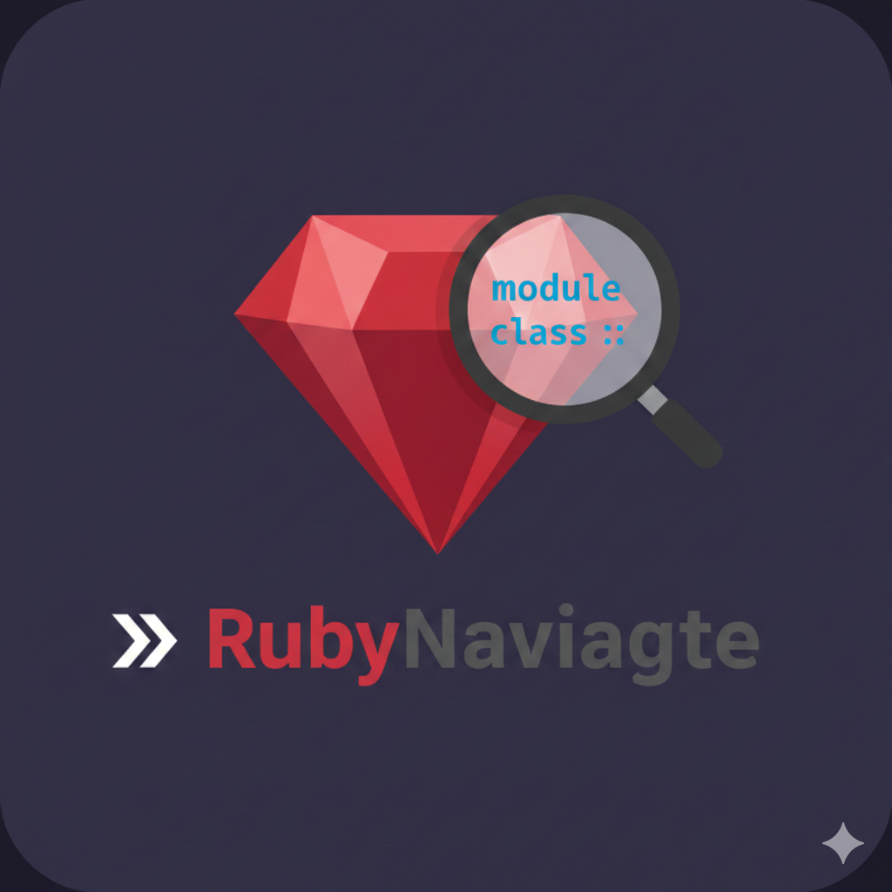

# RubyNavigate



Quickly jump to Ruby classes and modules by their fully qualified names. Perfect for navigating large Ruby projects with deeply nested class hierarchies.

## Features

- **Fast Navigation**: Search and jump to any Ruby class or module in your workspace
- **Fully Qualified Names**: Support for nested modules and qualified class names (e.g., `Foo::Bar::Baz`)
- **Live Filtering**: Results update as you type
- **Smart Grouping**: Results are organized into three sections:
  - **Currently open** files (with Ruby symbols)
  - **Recently opened** files you've previously navigated to
  - **Workspace results** for all other matches
- **Recent History Management**: Remove items from recently opened with the X button
- **Configurable Limits**: Control how many items appear in each section
- **Workspace Scanning**: Automatically discovers Ruby files in your project

## Usage

1. Open the command palette (`Ctrl+Shift+P` / `Cmd+Shift+P`)
2. Run: **RubyNavigate: Find Class/Module**
3. Type the class or module name you're looking for
4. Select a result to jump to that file

## Keyboard Shortcuts

You can add a custom keyboard shortcut to quickly access RubyNavigate:

1. Open keyboard shortcuts: `Ctrl+K Ctrl+S` (Windows/Linux) or `Cmd+K Cmd+S` (Mac)
2. Search for "RubyNavigate"
3. Click the pencil icon next to "RubyNavigate: Find Class/Module"
4. Press your desired key combination (e.g., `Ctrl+Shift+/`)
5. Press Enter to confirm

Alternatively, you can manually add this to your `keybindings.json`:

```json
{
  "key": "ctrl+shift+/",
  "command": "rubynavigate.find"
}
```

## Configuration

Customize the behavior of RubyNavigate through VS Code settings:

- **`rubynavigate.maxCurrentlyOpenItems`** (default: `10`)  
  Maximum number of currently open items to display in the Quick Pick.

- **`rubynavigate.maxRecentlyOpenedItems`** (default: `10`)  
  Maximum number of recently opened items to display in the Quick Pick.

Example settings:

```json
{
  "rubynavigate.maxCurrentlyOpenItems": 15,
  "rubynavigate.maxRecentlyOpenedItems": 20
}
```

## Examples

Given a project structure:

```
app/models/
  user.rb          # class User
  admin/
    panel.rb       # module Admin; class Panel; end
lib/
  utils.rb         # module Utils; class Helper; end
```

You can search for:

- `User` - Finds the User class
- `Admin::Panel` - Finds the Panel class nested in Admin module
- `Utils::Helper` - Finds the Helper class in Utils module
- `Panel` - Partial match also works (case-insensitive)
- `Ad` - Prefix matching to find Admin module classes
